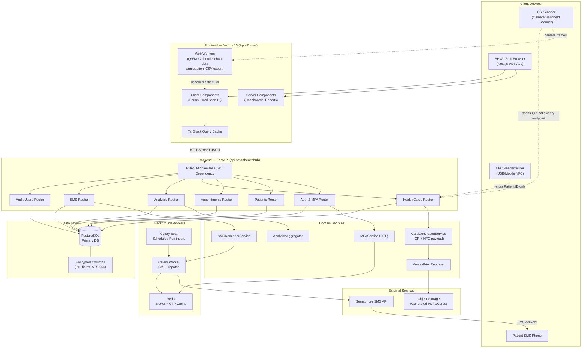
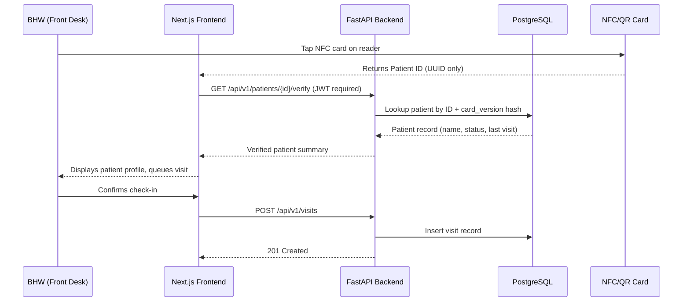
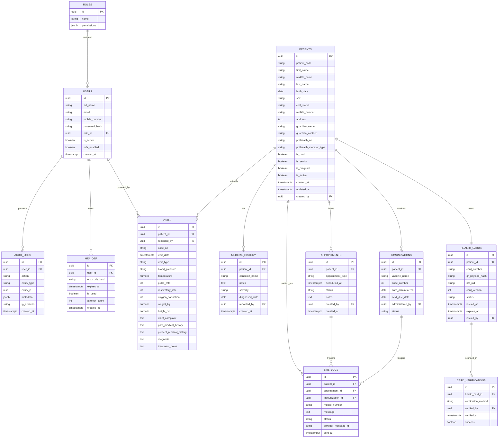
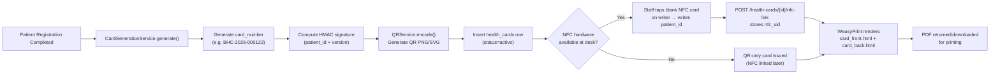
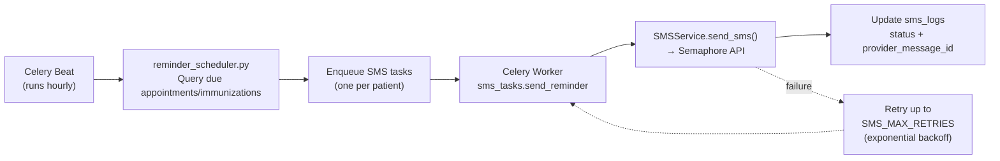
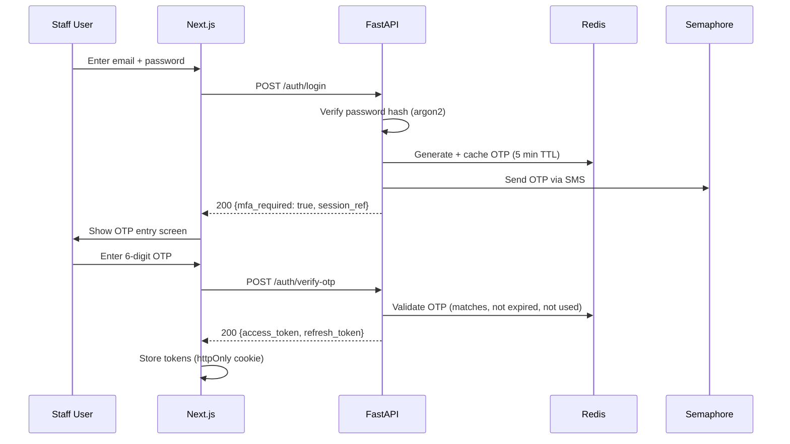
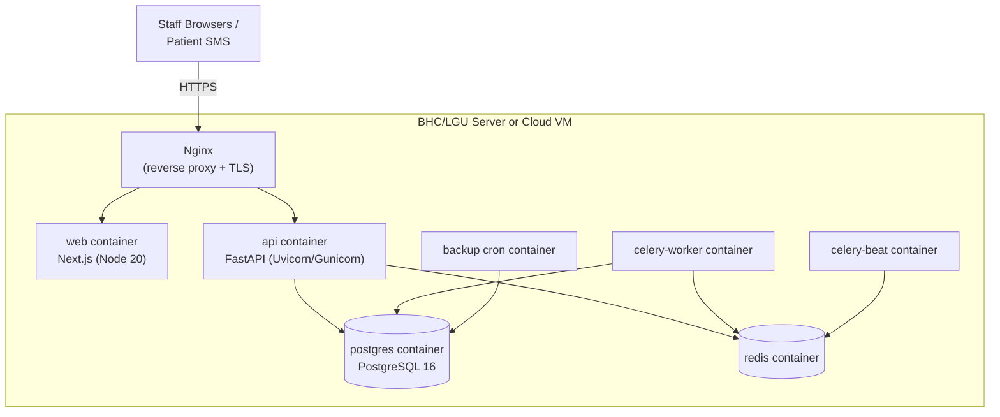
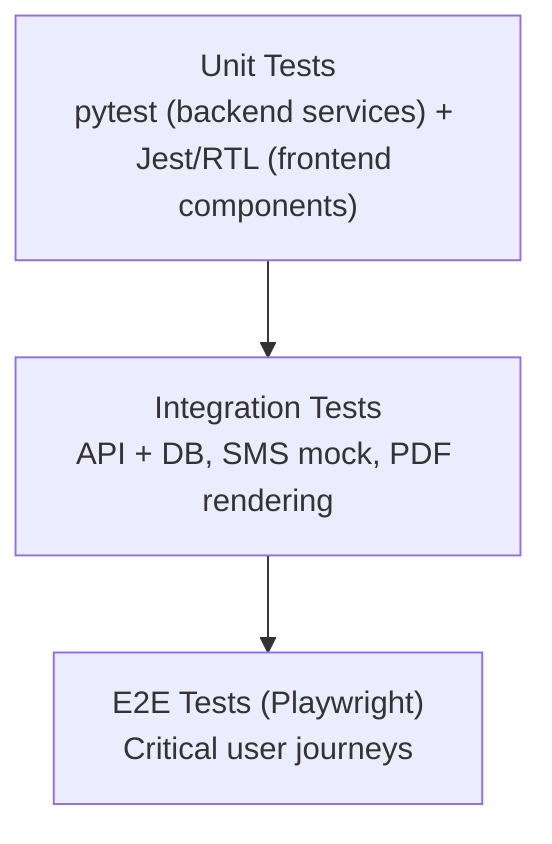

# SmartHealth Hub
## System Development Plan
### An Integrated Health Care Information Management System for Barangay Health Centers with NFC ID Card and SMS Notification Services

**Version:** 1.0
**Prepared for:** Barangay Health Center (BHC) Digitalization Initiative
**Tech Stack:** React + TypeScript + Next.js 15 (App Router) · Python + FastAPI · PostgreSQL · WeasyPrint · Semaphore SMS API · JWT + MFA (OTP) · Hybrid NFC/QR Health Cards

---

## Table of Contents

1. [Project Overview & Objectives](#1-project-overview--objectives)
2. [System Architecture](#2-system-architecture)
3. [Complete Folder Structure](#3-complete-folder-structure)
4. [Database Schema](#4-database-schema)
5. [Complete Feature List](#5-complete-feature-list)
6. [API Endpoints](#6-api-endpoints)
7. [Frontend Structure & Pages](#7-frontend-structure--pages)
8. [Health Card Generation Module](#8-health-card-generation-module)
9. [SMS Integration (Semaphore)](#9-sms-integration-semaphore)
10. [Security & MFA Implementation](#10-security--mfa-implementation)
11. [Deployment & Infrastructure](#11-deployment--infrastructure)
12. [Development Roadmap](#12-development-roadmap)
13. [Testing Strategy](#13-testing-strategy)

---

## 1. Project Overview & Objectives

### 1.1 Background

Barangay Health Centers (BHCs) are the first line of primary health care in the Philippines, but most still rely on logbooks, paper forms, and manually written health/immunization cards. This causes long patient queues, inconsistent and duplicated records, missed follow-ups (no reminder mechanism), and no real-time reporting for BHWs, physicians, or LGUs.

**SmartHealth Hub** digitizes this workflow end-to-end: patient registration and medical history, automated hybrid **NFC + QR** health card generation, an **analytics dashboard**, **SMS reminders** for appointments/vaccinations, and **secure MFA-protected access** for authorized staff only.

### 1.2 General Objective

> To improve record keeping, data security, and healthcare service delivery at Barangay Health Centers by developing a robust analytics and card generation system with integrated SMS reminders and multi-factor authentication.

### 1.3 Specific Objectives (mapped to system deliverables)

| # | Thesis Specific Objective | System Deliverable |
|---|---|---|
| 1 | Create a digital system that automatically records, updates, and retrieves patient health records | Patient Records Module (FastAPI + PostgreSQL, full CRUD, versioned history) |
| 2 | Provide real-time analytics and insights for decision-making | Analytics Dashboard Module (Recharts/Chart.js on Next.js, aggregation endpoints in FastAPI) |
| 3 | Create a module for printable/usable health cards | Health Card Generation Module (WeasyPrint PDF + QR + NFC write payload) |
| 4 | Add multi-factor authentication for safe access | JWT Auth + SMS OTP (Semaphore) MFA layer |
| 5 | Send SMS reminders for check-ups, vaccinations, appointments | SMS Reminder Scheduler (Celery/APScheduler + Semaphore API) |
| 6 | Improve accuracy, accessibility, and efficiency of records | Centralized PostgreSQL DB with audit logging & role-based access |
| 7 | Measure user satisfaction and system reliability (ISO 25010) | UAT plan and instrumentation (see [Section 13](#13-testing-strategy)) |

### 1.4 Scope Recap (from thesis, retained in system design)

- Patient registration and record management
- Analytics dashboard (vaccination status, follow-up rates, illness trends)
- Health card generation — printable **and** NFC/QR-based digital verification
- Multi-Factor Authentication (OTP-based)
- SMS alert/reminder module
- Role-based access for BHWs and authorized staff only

### 1.5 Delimitations Carried Into Design

- **Single-BHC scoped**: no cross-BHC data sharing in v1 (multi-tenant architecture is scaffolded but disabled by default — see [12.6](#126-post-launch--future-phases)).
- **SMS dependent on carrier signal** — system must gracefully queue and retry, never block core workflows on SMS delivery.
- **Not diagnostic** — the system only manages records/administrative workflow; it does not perform clinical decision support.
- Pilot-barangay data only; architecture must still be portable enough to scale later (hence containerized, cloud-agnostic deployment).

---

## 2. System Architecture

### 2.1 Architectural Style

SmartHealth Hub is a **modular monolith** on the backend (FastAPI, organized into clearly bounded modules/routers) paired with a **decoupled SPA/SSR frontend** (Next.js 15). This is deliberately chosen over microservices: a single BHC deployment does not need distributed-systems overhead, but the backend is structured so any module (e.g., SMS, Health Cards) could later be extracted into its own service if scaled to a multi-BHC / provincial deployment.

**Layers:**

1. **Presentation Layer** — Next.js 15 (App Router), server components for data-heavy pages (analytics, patient lists), client components for interactive forms (registration, card scan/verify).
2. **API Layer** — FastAPI, versioned (`/api/v1`), routers per domain, Pydantic v2 schemas for validation, dependency-injected auth/RBAC.
3. **Service/Domain Layer** — business logic isolated from HTTP layer (e.g., `CardGenerationService`, `SMSReminderService`, `MFAService`).
4. **Data Layer** — PostgreSQL via SQLAlchemy 2.0 (async) + Alembic migrations.
5. **Integration Layer** — Semaphore SMS API, WeasyPrint rendering engine, NFC/QR encode-decode utilities.
6. **Background Processing** — Celery workers + Redis (broker/result backend) for SMS dispatch, scheduled reminders, PDF batch generation, and OTP expiry cleanup.
7. **Client-Side Compute Layer** — native browser Web Workers (via Comlink) for CPU-heavy in-browser tasks that would otherwise jank the UI: live QR/NFC scan decoding, analytics chart-data aggregation, and CSV export formatting. This is intentionally distinct from item 6 — Celery workers run server-side background jobs on the backend; Web Workers run client-side, in the BHW's own browser tab, and exist purely to keep the main thread free for rendering and input. See Section 7.4 for the full design.

### 2.2 High-Level Architecture Diagram



### 2.3 Request Flow Example — Patient Check-In via NFC Card



### 2.4 Why This Stack

| Requirement (from thesis) | Chosen Technology | Rationale |
|---|---|---|
| Real-time analytics/dashboards | Next.js Server Components + FastAPI aggregation endpoints | SSR gives fast first paint for dashboards; FastAPI async handles concurrent report queries efficiently |
| Secure patient data storage | PostgreSQL + `pgcrypto`/application-level AES-256 | Strong ACID guarantees, native encryption extensions, mature RBAC |
| Printable + digital health cards | WeasyPrint (HTML/CSS → PDF) | Enables designing the card visually in HTML/CSS (easy to iterate) then rendering pixel-accurate PDFs |
| SMS reminders (Philippine context) | Semaphore API | Local SMS gateway with PH telco support, reasonable pricing, simple REST API |
| MFA / safe access | JWT + OTP via SMS | No extra hardware needed for BHWs; OTP sent to registered staff mobile numbers |
| NFC + QR hybrid card | Web NFC API (where supported) + QR fallback | QR ensures universal compatibility (any camera/scanner); NFC gives tap-to-verify speed where hardware supports it |
| Smooth UI during CPU-heavy client tasks | Native Web Workers + Comlink | Keeps the main thread free for rendering/input during live QR/NFC scan decoding, analytics data crunching, and CSV export — matters most on the older, lower-spec desktops common at BHC front desks |

---

## 3. Complete Folder Structure

SmartHealth Hub is organized as a **monorepo** using **Turborepo** to orchestrate builds, dev servers, linting, and tests across the frontend, backend, and shared-types package, with pnpm workspaces for dependency management and Docker Compose tying everything together for local dev and deployment.

```
smarthealth-hub/
├── frontend/
│   └── web/                                # Next.js 15 frontend (App Router)
│       ├── app/
│       │   ├── (auth)/
│       │   │   ├── login/
│       │   │   │   └── page.tsx
│       │   │   ├── verify-otp/
│       │   │   │   └── page.tsx
│       │   │   └── layout.tsx
│       │   ├── (dashboard)/
│       │   │   ├── dashboard/
│       │   │   │   └── page.tsx            # Analytics overview
│       │   │   ├── patients/
│       │   │   │   ├── page.tsx            # Patient list/search
│       │   │   │   ├── new/page.tsx        # Registration form
│       │   │   │   └── [patientId]/
│       │   │   │       ├── page.tsx        # Patient profile
│       │   │   │       ├── history/page.tsx
│       │   │   │       └── edit/page.tsx
│       │   │   ├── appointments/
│       │   │   │   ├── page.tsx
│       │   │   │   └── [appointmentId]/page.tsx
│       │   │   ├── immunizations/
│       │   │   │   └── page.tsx
│       │   │   ├── health-cards/
│       │   │   │   ├── page.tsx            # Card management
│       │   │   │   ├── verify/page.tsx     # NFC/QR scan-to-verify UI
│       │   │   │   └── [patientId]/print/page.tsx
│       │   │   ├── analytics/
│       │   │   │   ├── page.tsx
│       │   │   │   ├── illness-trends/page.tsx
│       │   │   │   └── reports/page.tsx    # Exportable reports (PDF/CSV)
│       │   │   ├── sms-logs/
│       │   │   │   └── page.tsx
│       │   │   ├── settings/
│       │   │   │   ├── users/page.tsx      # Staff/role management
│       │   │   │   ├── profile/page.tsx
│       │   │   │   └── audit-log/page.tsx
│       │   │   └── layout.tsx              # Sidebar/topbar shell
│       │   ├── api/
│       │   │   └── health/route.ts         # Frontend liveness check
│       │   ├── layout.tsx                  # Root layout
│       │   ├── globals.css
│       │   └── not-found.tsx
│       ├── components/
│       │   ├── ui/                         # shadcn/ui primitives (button, dialog, etc.)
│       │   ├── forms/
│       │   │   ├── PatientRegistrationForm.tsx
│       │   │   ├── AppointmentForm.tsx
│       │   │   └── OtpInput.tsx
│       │   ├── charts/
│       │   │   ├── VaccinationCoverageChart.tsx
│       │   │   ├── IllnessTrendChart.tsx
│       │   │   └── PatientVisitsChart.tsx
│       │   ├── cards/
│       │   │   ├── HealthCardPreview.tsx
│       │   │   └── NfcScanButton.tsx
│       │   ├── layout/
│       │   │   ├── Sidebar.tsx
│       │   │   ├── Topbar.tsx
│       │   │   └── RoleGuard.tsx
│       │   └── tables/
│       │       ├── PatientTable.tsx
│       │       └── DataTable.tsx
│       ├── lib/
│       │   ├── api-client.ts               # Typed fetch wrapper (axios/ky)
│       │   ├── auth.ts                     # Token storage/refresh logic
│       │   ├── nfc.ts                      # Web NFC read/write helpers (delegates decode-heavy work to workers/)
│       │   ├── qr.ts                       # QR generation/scan helpers (delegates decode-heavy work to workers/)
│       │   └── utils.ts
│       ├── workers/                        # Browser Web Workers — see note below tree, and §7.4
│       │   ├── qrScanner.worker.ts         # Decodes camera frames during live QR scan (health-cards/verify)
│       │   ├── qrGenerator.worker.ts       # Renders QR preview images off the main thread
│       │   ├── patientSearch.worker.ts     # Client-side fuzzy filter/highlight over the loaded patient page
│       │   ├── analyticsAggregator.worker.ts # Reshapes raw API JSON into chart-ready series
│       │   └── csvExport.worker.ts         # Formats large report datasets into CSV client-side
│       ├── hooks/
│       │   ├── usePatients.ts
│       │   ├── useAuth.ts
│       │   ├── useAnalytics.ts
│       │   ├── useOtpTimer.ts
│       │   └── useWebWorker.ts             # Generic Comlink-wrapped worker factory hook (see 7.4)
│       ├── types/
│       │   ├── patient.ts
│       │   ├── appointment.ts
│       │   ├── healthCard.ts
│       │   └── api.ts
│       ├── middleware.ts                   # Route protection (JWT cookie check)
│       ├── next.config.ts
│       ├── tsconfig.json
│       ├── package.json                    # name: "web" — used by turbo/pnpm --filter
│       └── .env.local.example
│
├── backend/                                # FastAPI backend (Python)
│   ├── app/
│   │   ├── main.py                         # FastAPI app entrypoint
│   │   ├── core/
│   │   │   ├── config.py                   # Pydantic Settings (env vars)
│   │   │   ├── security.py                 # JWT, password hashing
│   │   │   ├── logging.py
│   │   │   └── exceptions.py               # Custom exception handlers
│   │   ├── api/
│   │   │   └── v1/
│   │   │       ├── router.py               # Aggregates all routers
│   │   │       └── endpoints/
│   │   │           ├── auth.py
│   │   │           ├── mfa.py
│   │   │           ├── patients.py
│   │   │           ├── medical_history.py
│   │   │           ├── appointments.py
│   │   │           ├── immunizations.py
│   │   │           ├── health_cards.py
│   │   │           ├── analytics.py
│   │   │           ├── sms.py
│   │   │           ├── users.py
│   │   │           └── audit.py
│   │   ├── models/                         # SQLAlchemy ORM models
│   │   │   ├── user.py
│   │   │   ├── patient.py
│   │   │   ├── medical_history.py
│   │   │   ├── immunization.py
│   │   │   ├── appointment.py
│   │   │   ├── visit.py
│   │   │   ├── health_card.py
│   │   │   ├── mfa_otp.py
│   │   │   ├── sms_log.py
│   │   │   └── audit_log.py
│   │   ├── schemas/                        # Pydantic request/response models
│   │   │   ├── patient.py
│   │   │   ├── appointment.py
│   │   │   ├── health_card.py
│   │   │   ├── auth.py
│   │   │   └── analytics.py
│   │   ├── services/                       # Domain/business logic
│   │   │   ├── card_generation_service.py
│   │   │   ├── pdf_renderer.py             # WeasyPrint wrapper
│   │   │   ├── qr_service.py
│   │   │   ├── nfc_payload_service.py
│   │   │   ├── sms_service.py              # Semaphore integration
│   │   │   ├── mfa_service.py
│   │   │   ├── analytics_service.py
│   │   │   └── audit_service.py
│   │   ├── templates/
│   │   │   └── health_card/
│   │   │       ├── card_front.html
│   │   │       ├── card_back.html
│   │   │       └── card_styles.css
│   │   ├── workers/
│   │   │   ├── celery_app.py
│   │   │   ├── sms_tasks.py
│   │   │   └── reminder_scheduler.py       # Celery Beat schedule config
│   │   ├── db/
│   │   │   ├── session.py                  # Async SQLAlchemy engine/session
│   │   │   └── base.py
│   │   └── utils/
│   │       ├── encryption.py
│   │       └── validators.py
│   ├── alembic/
│   │   ├── versions/
│   │   └── env.py
│   ├── alembic.ini
│   ├── tests/
│   │   ├── conftest.py
│   │   ├── test_auth.py
│   │   ├── test_patients.py
│   │   ├── test_health_cards.py
│   │   ├── test_sms.py
│   │   └── test_analytics.py
│   ├── pyproject.toml
│   ├── requirements.txt
│   ├── package.json                        # Thin wrapper so Turborepo can orchestrate Python tasks (see 3.1)
│   └── .env.example
│
├── packages/
│   └── shared-types/                       # Shared TS interfaces mirrored from Pydantic schemas
│       ├── src/
│       │   ├── patient.ts
│       │   ├── appointment.ts
│       │   └── index.ts
│       └── package.json
│
├── infra/
│   ├── docker/
│   │   ├── Dockerfile.web
│   │   ├── Dockerfile.api
│   │   └── Dockerfile.worker
│   ├── docker-compose.yml
│   ├── docker-compose.prod.yml
│   └── nginx/
│       └── nginx.conf
│
├── docs/
│   ├── er-diagram.md
│   ├── api-reference.md
│   └── uat-forms/
│       └── iso25010-evaluation-form.md
│
├── scripts/
│   ├── seed_db.py
│   └── backup_db.sh
│
├── .github/
│   └── workflows/
│       ├── ci.yml
│       └── deploy.yml
│
├── package.json                            # Root workspace config
├── pnpm-workspace.yaml
├── turbo.json                              # Turborepo pipeline config (see 3.1)
├── .gitignore
└── README.md
```

**Key organizational principles:**
- `frontend/web` and `backend` are fully independent deployables — either can be redeployed without touching the other. `frontend/` is nested one level deep (rather than the Next.js app sitting at the root) so a future second frontend target — a PWA shell, a kiosk-mode build, etc. — has an obvious place to live alongside `web/` without a restructure.
- `backend/app/` *is* the FastAPI package itself (no intermediate `api/` folder) — `backend/` is the deployable unit, `app/` is its importable Python package, matching what `main.py`, `alembic/env.py`, and every Celery task already reference internally (e.g., `celery -A app.workers.celery_app`).
- `services/` in the backend isolates business logic from FastAPI routing, making unit testing straightforward and allowing reuse (e.g., `CardGenerationService` is called both by the API endpoint and by a Celery batch task for reprinting cards).
- `templates/health_card/` keeps the card's visual design as editable HTML/CSS, decoupled from Python logic.
- `frontend/web/workers/` holds **browser-native Web Workers** — do not confuse these with `backend/app/workers/` (Celery background jobs). Celery workers run server-side, process SMS/reminders, and never touch the DOM; the files here run client-side, inside the BHW's own browser tab, purely to keep the UI thread free during CPU-heavy work like live QR decoding. Full rationale and code pattern in Section 7.4.

### 3.1 Turborepo Configuration

Turborepo needs a `package.json` with `scripts` in every workspace it orchestrates — including non-JS ones. `backend/` gets a minimal wrapper so Python tasks (`dev`, `test`, `lint`, `db:migrate`) run through the same `turbo <task>` commands as the frontend, with dependency-aware ordering and parallelization. There's no build-cache benefit on the Python side (no cacheable output), but you still get unified DX: one command starts everything, one command tests everything.

```json
// backend/package.json
{
  "name": "backend",
  "private": true,
  "scripts": {
    "dev": "uvicorn app.main:app --reload --host 0.0.0.0 --port 8000",
    "build": "echo 'no build step for backend'",
    "lint": "ruff check . && mypy app",
    "test": "pytest --cov=app",
    "db:migrate": "alembic upgrade head"
  }
}
```

```json
// turbo.json (root)
{
  "$schema": "https://turbo.build/schema.json",
  "ui": "tui",
  "tasks": {
    "build": {
      "dependsOn": ["^build"],
      "outputs": ["dist/**", ".next/**"]
    },
    "dev": {
      "cache": false,
      "persistent": true
    },
    "lint": {
      "dependsOn": ["^lint"]
    },
    "test": {
      "dependsOn": ["^build"],
      "outputs": ["coverage/**"]
    },
    "db:migrate": {
      "cache": false
    }
  }
}
```

```yaml
# pnpm-workspace.yaml (root)
packages:
  - "frontend/*"
  - "backend"
  - "packages/*"
```

With this in place: `turbo dev` boots the Next.js dev server and `uvicorn --reload` together in one terminal (each task's output prefixed by workspace name); `turbo build` builds the frontend and shared-types package (backend no-ops); `turbo lint` and `turbo test` run both stacks' linters/test suites in parallel. Reach for `turbo dev --filter=web` or `turbo test --filter=backend` when you only want one side.

---

## 4. Database Schema

### 4.1 Entity-Relationship Overview



### 4.2 SQL DDL (PostgreSQL)

```sql
-- Enable required extensions
CREATE EXTENSION IF NOT EXISTS "pgcrypto";
CREATE EXTENSION IF NOT EXISTS "uuid-ossp";

-- ==========================
-- ROLES & USERS (Staff)
-- ==========================
CREATE TABLE roles (
    id UUID PRIMARY KEY DEFAULT gen_random_uuid(),
    name VARCHAR(50) UNIQUE NOT NULL,          -- 'admin', 'bhw', 'physician', 'nurse', 'midwife'
    permissions JSONB NOT NULL DEFAULT '{}',
    created_at TIMESTAMPTZ NOT NULL DEFAULT now()
);

CREATE TABLE users (
    id UUID PRIMARY KEY DEFAULT gen_random_uuid(),
    full_name VARCHAR(150) NOT NULL,
    email VARCHAR(150) UNIQUE NOT NULL,
    mobile_number VARCHAR(20) UNIQUE NOT NULL, -- used for MFA OTP delivery
    password_hash TEXT NOT NULL,
    role_id UUID NOT NULL REFERENCES roles(id),
    is_active BOOLEAN NOT NULL DEFAULT TRUE,
    mfa_enabled BOOLEAN NOT NULL DEFAULT TRUE,
    last_login_at TIMESTAMPTZ,
    created_at TIMESTAMPTZ NOT NULL DEFAULT now(),
    updated_at TIMESTAMPTZ NOT NULL DEFAULT now()
);
CREATE INDEX idx_users_role ON users(role_id);
CREATE INDEX idx_users_email ON users(email);

-- ==========================
-- PATIENTS
-- ==========================
CREATE TABLE patients (
    id UUID PRIMARY KEY DEFAULT gen_random_uuid(),
    patient_code VARCHAR(20) UNIQUE NOT NULL,   -- human-readable e.g. BHC-2026-000123
    first_name VARCHAR(100) NOT NULL,
    middle_name VARCHAR(100),
    last_name VARCHAR(100) NOT NULL,
    birth_date DATE NOT NULL,
    sex VARCHAR(10) NOT NULL CHECK (sex IN ('male', 'female')),
    civil_status VARCHAR(20),
    mobile_number VARCHAR(20),                  -- "CONTACT NO." on the RHU form (+63xxxxxxxxxx format)
    address TEXT NOT NULL,                      -- "COMPLETE ADDRESS" on the RHU form
    guardian_name VARCHAR(150),
    guardian_contact VARCHAR(20),
    philhealth_no VARCHAR(20),
    philhealth_member_type VARCHAR(20)          -- from RHU form "PHILHEALTH MEMBER / DEPENDENTS"
        CHECK (philhealth_member_type IN ('member', 'dependent')),
    is_pwd BOOLEAN NOT NULL DEFAULT FALSE,
    is_senior BOOLEAN NOT NULL DEFAULT FALSE,   -- auto-set to TRUE when age >= 60 on registration
    is_pregnant BOOLEAN NOT NULL DEFAULT FALSE,
    is_active BOOLEAN NOT NULL DEFAULT TRUE,
    created_by UUID REFERENCES users(id),
    created_at TIMESTAMPTZ NOT NULL DEFAULT now(),
    updated_at TIMESTAMPTZ NOT NULL DEFAULT now()
);
CREATE INDEX idx_patients_name ON patients(last_name, first_name);
CREATE INDEX idx_patients_code ON patients(patient_code);
CREATE INDEX idx_patients_mobile ON patients(mobile_number);

-- ==========================
-- MEDICAL HISTORY
-- ==========================
CREATE TABLE medical_history (
    id UUID PRIMARY KEY DEFAULT gen_random_uuid(),
    patient_id UUID NOT NULL REFERENCES patients(id) ON DELETE CASCADE,
    condition_name VARCHAR(150) NOT NULL,
    notes TEXT,
    severity VARCHAR(20) CHECK (severity IN ('mild', 'moderate', 'severe')),
    diagnosed_date DATE,
    recorded_by UUID REFERENCES users(id),
    created_at TIMESTAMPTZ NOT NULL DEFAULT now()
);
CREATE INDEX idx_medhist_patient ON medical_history(patient_id);

-- ==========================
-- IMMUNIZATIONS
-- ==========================
CREATE TABLE immunizations (
    id UUID PRIMARY KEY DEFAULT gen_random_uuid(),
    patient_id UUID NOT NULL REFERENCES patients(id) ON DELETE CASCADE,
    vaccine_name VARCHAR(100) NOT NULL,
    dose_number INT NOT NULL DEFAULT 1,
    date_administered DATE,
    next_due_date DATE,
    administered_by UUID REFERENCES users(id),
    status VARCHAR(20) NOT NULL DEFAULT 'scheduled'
        CHECK (status IN ('scheduled', 'completed', 'missed', 'cancelled')),
    created_at TIMESTAMPTZ NOT NULL DEFAULT now()
);
CREATE INDEX idx_immun_patient ON immunizations(patient_id);
CREATE INDEX idx_immun_next_due ON immunizations(next_due_date);

-- ==========================
-- APPOINTMENTS
-- ==========================
CREATE TABLE appointments (
    id UUID PRIMARY KEY DEFAULT gen_random_uuid(),
    patient_id UUID NOT NULL REFERENCES patients(id) ON DELETE CASCADE,
    appointment_type VARCHAR(50) NOT NULL,      -- 'checkup', 'prenatal', 'follow_up', 'vaccination'
    scheduled_at TIMESTAMPTZ NOT NULL,
    status VARCHAR(20) NOT NULL DEFAULT 'pending'
        CHECK (status IN ('pending', 'confirmed', 'completed', 'missed', 'cancelled')),
    notes TEXT,
    created_by UUID REFERENCES users(id),
    created_at TIMESTAMPTZ NOT NULL DEFAULT now()
);
CREATE INDEX idx_appt_patient ON appointments(patient_id);
CREATE INDEX idx_appt_schedule ON appointments(scheduled_at);
CREATE INDEX idx_appt_status ON appointments(status);

-- ==========================
-- VISITS (walk-in / check-in log)
-- Aligns with RHU Patient Record visit log: one row per consultation.
-- Vital signs columns capture the VITAL SIGNS column from the physical form.
-- case_no mirrors the CASE NO. column (auto-generated: BHC-VISIT-YYYY-NNNNNN).
-- ==========================
CREATE TABLE visits (
    id UUID PRIMARY KEY DEFAULT gen_random_uuid(),
    patient_id UUID NOT NULL REFERENCES patients(id) ON DELETE CASCADE,
    recorded_by UUID REFERENCES users(id),
    case_no VARCHAR(30) UNIQUE,                  -- RHU form CASE NO. (auto-gen: BHC-VISIT-2026-000001)
    visit_date TIMESTAMPTZ NOT NULL DEFAULT now(),
    visit_type VARCHAR(50) NOT NULL,             -- 'consultation', 'immunization', 'prenatal'
    -- Vital signs (VITAL SIGNS column on RHU form)
    blood_pressure VARCHAR(20),                  -- e.g. "120/80 mmHg"
    temperature NUMERIC(4,1),                    -- degrees Celsius
    pulse_rate INT,                              -- beats per minute
    respiratory_rate INT,                        -- breaths per minute
    oxygen_saturation INT,                       -- SpO2 %
    weight_kg NUMERIC(5,2),                      -- kilograms
    height_cm NUMERIC(5,1),                      -- centimeters
    -- Complaint and history (CHIEF COMPLAINT / PAST/PRESENT MEDICAL HISTORY on RHU form)
    chief_complaint TEXT,
    past_medical_history TEXT,                   -- patient's prior conditions relevant to this visit
    present_medical_history TEXT,                -- current history of presenting illness
    -- Diagnosis and treatment (DIAGNOSIS / TREATMENT column on RHU form) — AES-256-GCM encrypted
    diagnosis TEXT,
    treatment_notes TEXT,
    created_at TIMESTAMPTZ NOT NULL DEFAULT now()
);
CREATE INDEX idx_visits_patient ON visits(patient_id);
CREATE INDEX idx_visits_date ON visits(visit_date);
CREATE INDEX idx_visits_case_no ON visits(case_no);

-- ==========================
-- HEALTH CARDS (Hybrid NFC + QR)
-- ==========================
CREATE TABLE health_cards (
    id UUID PRIMARY KEY DEFAULT gen_random_uuid(),
    patient_id UUID NOT NULL UNIQUE REFERENCES patients(id) ON DELETE CASCADE,
    card_number VARCHAR(30) UNIQUE NOT NULL,
    qr_payload_hash TEXT NOT NULL,              -- HMAC of patient_id + card_version + secret
    nfc_uid VARCHAR(64) UNIQUE,                  -- NFC tag UID once written (nullable until issued)
    card_version INT NOT NULL DEFAULT 1,
    status VARCHAR(20) NOT NULL DEFAULT 'active'
        CHECK (status IN ('active', 'lost', 'reissued', 'revoked')),
    issued_at TIMESTAMPTZ NOT NULL DEFAULT now(),
    expires_at TIMESTAMPTZ,
    issued_by UUID REFERENCES users(id)
);
CREATE INDEX idx_cards_patient ON health_cards(patient_id);
CREATE INDEX idx_cards_number ON health_cards(card_number);

-- ==========================
-- CARD VERIFICATIONS (scan/tap audit trail)
-- ==========================
CREATE TABLE card_verifications (
    id UUID PRIMARY KEY DEFAULT gen_random_uuid(),
    health_card_id UUID NOT NULL REFERENCES health_cards(id) ON DELETE CASCADE,
    verification_method VARCHAR(10) NOT NULL CHECK (verification_method IN ('nfc', 'qr')),
    verified_by UUID REFERENCES users(id),
    verified_at TIMESTAMPTZ NOT NULL DEFAULT now(),
    success BOOLEAN NOT NULL DEFAULT TRUE
);
CREATE INDEX idx_cardverif_card ON card_verifications(health_card_id);

-- ==========================
-- MFA / OTP
-- ==========================
CREATE TABLE mfa_otp (
    id UUID PRIMARY KEY DEFAULT gen_random_uuid(),
    user_id UUID NOT NULL REFERENCES users(id) ON DELETE CASCADE,
    otp_code_hash TEXT NOT NULL,                -- never store OTP in plaintext
    purpose VARCHAR(20) NOT NULL DEFAULT 'login' CHECK (purpose IN ('login', 'password_reset')),
    expires_at TIMESTAMPTZ NOT NULL,
    is_used BOOLEAN NOT NULL DEFAULT FALSE,
    attempt_count INT NOT NULL DEFAULT 0,
    created_at TIMESTAMPTZ NOT NULL DEFAULT now()
);
CREATE INDEX idx_otp_user ON mfa_otp(user_id);

-- ==========================
-- SMS LOGS
-- ==========================
CREATE TABLE sms_logs (
    id UUID PRIMARY KEY DEFAULT gen_random_uuid(),
    patient_id UUID REFERENCES patients(id) ON DELETE SET NULL,
    appointment_id UUID REFERENCES appointments(id) ON DELETE SET NULL,
    immunization_id UUID REFERENCES immunizations(id) ON DELETE SET NULL,
    mobile_number VARCHAR(20) NOT NULL,
    message TEXT NOT NULL,
    status VARCHAR(20) NOT NULL DEFAULT 'queued'
        CHECK (status IN ('queued', 'sent', 'failed', 'delivered')),
    provider_message_id VARCHAR(100),
    error_detail TEXT,
    sent_at TIMESTAMPTZ,
    created_at TIMESTAMPTZ NOT NULL DEFAULT now()
);
CREATE INDEX idx_sms_patient ON sms_logs(patient_id);
CREATE INDEX idx_sms_status ON sms_logs(status);

-- ==========================
-- AUDIT LOGS
-- ==========================
CREATE TABLE audit_logs (
    id UUID PRIMARY KEY DEFAULT gen_random_uuid(),
    user_id UUID REFERENCES users(id) ON DELETE SET NULL,
    action VARCHAR(50) NOT NULL,                -- 'CREATE', 'UPDATE', 'DELETE', 'VIEW', 'LOGIN'
    entity_type VARCHAR(50) NOT NULL,           -- 'patient', 'health_card', 'user'
    entity_id UUID,
    metadata JSONB DEFAULT '{}',
    ip_address VARCHAR(45),
    created_at TIMESTAMPTZ NOT NULL DEFAULT now()
);
CREATE INDEX idx_audit_user ON audit_logs(user_id);
CREATE INDEX idx_audit_entity ON audit_logs(entity_type, entity_id);
CREATE INDEX idx_audit_created ON audit_logs(created_at);
```

### 4.3 Design Notes

- **PHI field-level encryption**: sensitive free-text fields (`medical_history.notes`, `visits.diagnosis`, `visits.treatment_notes`) are encrypted at the application layer (AES-256-GCM) before insert, not just relying on disk-level encryption — decrypted only in memory when authorized users request them (see [Section 10](#10-security--mfa-implementation)).
- **NFC stores only `patient_id` (UUID)** — never PHI — per the thesis's privacy-conscious design intent. The `qr_payload_hash` prevents a scanned/replicated QR from being forged, since it's an HMAC tied to `card_version` and a server-side secret.
- **Soft-delete pattern** via `is_active` flags on `patients`/`users` rather than hard deletes, to preserve audit trail integrity.
- **`card_verifications`** gives a full tap/scan history per card — useful for detecting lost/cloned card misuse.

---

## 5. Complete Feature List

Prioritized using MoSCoW, grouped by module, each item traceable to a thesis objective.

### 5.1 Authentication & Access Control
| Priority | Feature |
|---|---|
| Must | Staff login (email + password) |
| Must | SMS OTP as second factor (MFA) on every login |
| Must | Role-based access control (Admin, BHW, Physician/Nurse/Midwife, Admin Staff) |
| Must | JWT access + refresh token rotation |
| Should | "Remember this device" (skip OTP for 7 days on trusted device) |
| Should | Account lockout after repeated failed OTP attempts |
| Could | Biometric WebAuthn as an alternative MFA factor (future) |

### 5.2 Patient Record Management (Obj. 1, 6)

**Real-world source:** This module digitizes the physical **"Rural Health Unit — Patubig, Municipal Health Office, Marilao, Bulacan — Sta Rosa 1 BHS — PATIENT RECORD"** form. Every field on that form maps to a database column; paper visit log rows become `visits` table rows.

**All fields captured from the RHU form:**

*Patient header section (registration-time demographics):*
- DATE — `patients.created_at` (registration timestamp)
- PATIENT'S FULL NAME: First Name → `first_name`, Middle Name → `middle_name`, Last Name → `last_name`
- AGE — computed from `birth_date` at query time; stored as `is_senior` (≥60) flag
- SEX — `sex` ('male' / 'female')
- BIRTHDAY — `birth_date`
- PHILHEALTH MEMBER / DEPENDENTS: YES/NO → existence of `philhealth_no`; MEMBER/DEPENDENT → `philhealth_member_type` ('member' / 'dependent')
- CONTACT NO. — `mobile_number` (Philippine mobile format: +63xxxxxxxxxx)
- COMPLETE ADDRESS — `address`

*Additional registration fields (system-captured, not on the paper form but required for operations):*
- `patient_code` — auto-generated unique identifier (BHC-YYYY-NNNNNN)
- `civil_status` — marital status
- `guardian_name`, `guardian_contact` — for minors, seniors, or PWD patients
- `is_pwd` — Person with Disability flag
- `is_pregnant` — current pregnancy flag (updated per visit for prenatal tracking)

*Visit/consultation log row (repeating table on the physical form):*
- CASE NO. → `visits.case_no` (auto-generated: BHC-VISIT-YYYY-NNNNNN)
- DATE / TIME → `visits.visit_date`
- VITAL SIGNS → `blood_pressure`, `temperature` (°C), `pulse_rate` (bpm), `respiratory_rate` (bpm), `oxygen_saturation` (SpO2 %), `weight_kg`, `height_cm`
- CHIEF COMPLAINT → `visits.chief_complaint`
- PAST MEDICAL HISTORY → `visits.past_medical_history`
- PRESENT MEDICAL HISTORY → `visits.present_medical_history`
- DIAGNOSIS → `visits.diagnosis` (AES-256-GCM encrypted)
- TREATMENT → `visits.treatment_notes` (AES-256-GCM encrypted)

| Priority | Feature |
|---|---|
| Must | Patient registration (all RHU form fields including PhilHealth type, contact, address, guardian info) |
| Must | Search/filter patients (name, patient code, mobile number) — instant client-side refinement offloaded to a Web Worker (§7.4) so typing never lags |
| Must | View/edit full patient profile |
| Must | Medical history log (conditions, severity, diagnosis date) |
| Must | Immunization records with dose tracking |
| Must | Visit/consultation logging (with full vital signs, case_no, past/present history, encrypted diagnosis/treatment) |
| Should | Flag vulnerable groups (senior, PWD, pregnant) for prioritized queueing |
| Should | Duplicate-patient detection on registration (fuzzy match on name + birthdate) |
| Could | Patient self-service portal (view own record via OTP-verified access) |

### 5.3 Appointment Management
| Priority | Feature |
|---|---|
| Must | Book/reschedule/cancel appointments |
| Must | Appointment calendar view (day/week) |
| Must | Status tracking (pending, confirmed, completed, missed) |
| Should | Physician/staff availability view |
| Could | Online patient-initiated appointment requests |

### 5.4 Health Card Generation (Obj. 3)
| Priority | Feature |
|---|---|
| Must | Auto-generate patient card on registration completion |
| Must | QR code encoding (HMAC-signed patient reference) |
| Must | NFC UID linking/write flow |
| Must | Printable PDF card (front + back) via WeasyPrint |
| Must | Card verification endpoint (scan/tap → patient summary) |
| Should | Real-time camera-based QR/NFC scan decoding via a dedicated Web Worker (§7.4) — keeps the live front-desk scanner preview smooth |
| Should | Card reissue flow (lost card → new `card_version`, invalidate old) |
| Should | Batch card printing for immunization-day drives |
| Could | Digital wallet card (Apple/Google Wallet pass) |

### 5.5 Analytics & Reporting (Obj. 2, 6)
| Priority | Feature |
|---|---|
| Must | Dashboard: total patients, visits this week/month, upcoming appointments |
| Must | Vaccination coverage chart (by vaccine, by age group) |
| Must | Illness/diagnosis trend chart (weekly/monthly/yearly) |
| Must | Missed appointment / no-show rate |
| Should | Exportable reports (CSV, PDF) for LGU/DOH submission — CSV formatting offloaded to a Web Worker (§7.4) for large datasets |
| Should | Demographic breakdown (senior citizens, PWD, pregnant patients served) |
| Should | Client-side chart-data aggregation via Web Worker (§7.4) — no dashboard jank when a BHW changes date-range filters over large datasets |
| Could | Predictive follow-up risk flagging (future ML enhancement, per thesis's "future researchers" note) |

### 5.6 SMS Notification Module (Obj. 5)
| Priority | Feature |
|---|---|
| Must | Automated appointment reminder SMS (configurable lead time, e.g., 1 day before) |
| Must | Immunization due-date reminder SMS |
| Must | Manual/ad-hoc SMS send (for BHW-initiated announcements) |
| Must | SMS delivery status logging |
| Should | Retry logic for failed sends |
| Should | Opt-out handling per patient |
| Could | Multi-language SMS templates (Filipino/English toggle) |

### 5.7 Security & Audit
| Priority | Feature |
|---|---|
| Must | Full audit trail (who viewed/edited what, when) |
| Must | Encrypted storage of sensitive medical notes |
| Must | HTTPS/TLS enforced everywhere |
| Should | Admin-facing audit log viewer with filters |
| Should | Automated DB backups |
| Could | Anomaly detection on unusual access patterns |

### 5.8 User & System Administration
| Priority | Feature |
|---|---|
| Must | Staff account management (create/deactivate/assign roles) |
| Must | Role/permission configuration |
| Should | System settings (SMS templates, reminder lead times) |
| Could | Multi-BHC tenant switch (future scaling per thesis's "Future Researchers" section) |

---

## 6. API Endpoints

All endpoints are prefixed `/api/v1`. Auth column: 🔓 Public · 🔑 Authenticated · 🛡️ Role-restricted.

### 6.1 Auth & MFA

| Method | Endpoint | Description | Auth |
|---|---|---|---|
| POST | `/auth/login` | Validate credentials, trigger OTP send | 🔓 |
| POST | `/auth/verify-otp` | Verify OTP, issue JWT access + refresh tokens | 🔓 |
| POST | `/auth/refresh` | Rotate access token using refresh token | 🔑 |
| POST | `/auth/logout` | Invalidate refresh token | 🔑 |
| POST | `/auth/resend-otp` | Resend OTP (rate-limited) | 🔓 |
| POST | `/auth/change-password` | Change own password | 🔑 |
| POST | `/auth/forgot-password` | Initiate OTP-based password reset | 🔓 |

### 6.2 Patients

| Method | Endpoint | Description | Auth |
|---|---|---|---|
| GET | `/patients` | List/search/paginate patients; query params: `q`, `page`, `page_size`, `is_senior`, `is_pwd`, `is_pregnant` | 🔑 |
| POST | `/patients` | Register new patient; auto-generates `patient_code`; response: `PatientResponse` | 🛡️ BHW+ |
| GET | `/patients/{id}` | Get full patient profile; audit log `VIEW_PHI` | 🔑 |
| PUT | `/patients/{id}` | Update patient demographics; audit log `UPDATE` | 🛡️ BHW+ |
| DELETE | `/patients/{id}` | Soft-deactivate (`is_active=false`); audit log `DELETE` | 🛡️ Admin |
| GET | `/patients/{id}/verify` | Verify identity via card scan (NFC/QR), returns `PatientVerifySummary` | 🔑 |
| GET | `/patients/{id}/visits` | List visit summaries (no PHI in list — `VisitSummary`) | 🔑 |
| POST | `/patients/{id}/visits` | Log a new visit/consultation with vital signs; auto-generates `case_no` | 🛡️ Clinical/BHW |

### 6.3 Medical History & Visits

Aligns with the RHU Patient Record form. Visit rows capture the full repeating visit log from the physical form including vital signs, case number, and separate past/present medical history fields.

| Method | Endpoint | Description | Auth |
|---|---|---|---|
| GET | `/patients/{id}/medical-history` | List conditions | 🔑 |
| POST | `/patients/{id}/medical-history` | Add condition entry; `notes` encrypted AES-256-GCM | 🛡️ Clinical staff |
| GET | `/patients/{id}/visits` | List visit history (no PHI — `VisitSummary`: case_no, date, type, chief_complaint only) | 🔑 |
| POST | `/patients/{id}/visits` | Log a new visit; body includes `VitalSigns`, `case_no` (auto-gen if omitted), `chief_complaint`, `past_medical_history`, `present_medical_history`, `diagnosis` (encrypted), `treatment_notes` (encrypted) | 🛡️ Clinical/BHW |
| GET | `/visits/{visit_id}` | Get full visit record with decrypted PHI fields; audit log `VIEW_PHI` | 🛡️ Clinical |

**VitalSigns sub-model fields:** `blood_pressure` (e.g. "120/80 mmHg"), `temperature` (°C, NUMERIC 4.1), `pulse_rate` (bpm, INT), `respiratory_rate` (bpm, INT), `oxygen_saturation` (SpO2 %, INT), `weight_kg` (NUMERIC 5.2), `height_cm` (NUMERIC 5.1) — all optional, matching the VITAL SIGNS column on the RHU form.

**case_no auto-generation pattern:** `BHC-VISIT-{YEAR}-{6-digit-zero-padded-seq}` — e.g. `BHC-VISIT-2026-000001`. Generated server-side by querying `MAX(case_no)` on the `visits` table; callers may omit it to have it auto-assigned.

### 6.4 Immunizations

| Method | Endpoint | Description | Auth |
|---|---|---|---|
| GET | `/patients/{id}/immunizations` | List immunization records | 🔑 |
| POST | `/patients/{id}/immunizations` | Record a new immunization/dose | 🛡️ Clinical staff |
| PUT | `/immunizations/{id}` | Update dose/next-due-date/status | 🛡️ Clinical staff |
| GET | `/immunizations/due` | List all patients with upcoming/overdue doses | 🔑 |

### 6.5 Appointments

| Method | Endpoint | Description | Auth |
|---|---|---|---|
| GET | `/appointments` | List appointments (filter by date/status) | 🔑 |
| POST | `/appointments` | Create appointment | 🔑 |
| GET | `/appointments/{id}` | Get appointment detail | 🔑 |
| PUT | `/appointments/{id}` | Reschedule/update status | 🔑 |
| DELETE | `/appointments/{id}` | Cancel appointment | 🔑 |

### 6.6 Health Cards

| Method | Endpoint | Description | Auth |
|---|---|---|---|
| POST | `/health-cards/{patient_id}/generate` | Generate/regenerate card (QR + NFC payload) | 🛡️ BHW+ |
| GET | `/health-cards/{patient_id}` | Get card metadata | 🔑 |
| GET | `/health-cards/{patient_id}/pdf` | Render + download printable PDF card | 🔑 |
| POST | `/health-cards/{patient_id}/nfc-link` | Bind a physical NFC tag UID to patient card | 🛡️ BHW+ |
| POST | `/health-cards/verify` | Verify scanned QR payload or tapped NFC UID | 🔑 |
| POST | `/health-cards/{patient_id}/reissue` | Reissue lost/damaged card (bumps `card_version`) | 🛡️ BHW+ |

### 6.7 Analytics

| Method | Endpoint | Description | Auth |
|---|---|---|---|
| GET | `/analytics/overview` | Dashboard summary (counts, trends) | 🔑 |
| GET | `/analytics/vaccination-coverage` | Coverage % by vaccine/age group | 🔑 |
| GET | `/analytics/illness-trends` | Diagnosis trends over time | 🔑 |
| GET | `/analytics/appointments/no-show-rate` | Missed appointment analytics | 🔑 |
| GET | `/analytics/export` | Export report as CSV/PDF | 🛡️ Admin/BHW |

### 6.8 SMS

| Method | Endpoint | Description | Auth |
|---|---|---|---|
| GET | `/sms/logs` | List sent/queued SMS with status | 🛡️ Admin/BHW |
| POST | `/sms/send-manual` | Send an ad-hoc SMS to a patient | 🛡️ BHW+ |
| POST | `/sms/webhook/delivery-status` | Semaphore delivery status callback | 🔓 (signed) |

### 6.9 Users & Audit

| Method | Endpoint | Description | Auth |
|---|---|---|---|
| GET | `/users` | List staff accounts | 🛡️ Admin |
| POST | `/users` | Create staff account | 🛡️ Admin |
| PUT | `/users/{id}` | Update role/status | 🛡️ Admin |
| DELETE | `/users/{id}` | Deactivate staff account | 🛡️ Admin |
| GET | `/audit-logs` | View audit trail (filterable) | 🛡️ Admin |

---

## 7. Frontend Structure & Pages

### 7.1 Route Map

| Route | Purpose | Access |
|---|---|---|
| `/login` | Credential entry | Public |
| `/verify-otp` | OTP entry (post-login) | Public (session-scoped) |
| `/dashboard` | Analytics overview, quick actions | All staff |
| `/patients` | Searchable/filterable patient list | BHW+ |
| `/patients/new` | Registration form (multi-step) | BHW+ |
| `/patients/[patientId]` | Profile: demographics, history, immunizations, visits | BHW+ |
| `/patients/[patientId]/edit` | Edit demographics | BHW+ |
| `/patients/[patientId]/history` | Medical history & visit timeline | Clinical staff |
| `/appointments` | Calendar + list view | BHW+ |
| `/appointments/[id]` | Appointment detail | BHW+ |
| `/immunizations` | Immunization tracking board (due/overdue) | Clinical staff |
| `/health-cards` | Card management, batch print queue | BHW+ |
| `/health-cards/verify` | Live NFC-tap / QR-scan verification UI | BHW+ |
| `/health-cards/[patientId]/print` | Printable card preview → PDF download | BHW+ |
| `/analytics` | Full dashboards (coverage, trends, no-show) | All staff |
| `/analytics/reports` | Export center (CSV/PDF for LGU/DOH) | Admin/BHW |
| `/sms-logs` | SMS delivery history | Admin/BHW |
| `/settings/users` | Staff account & role management | Admin |
| `/settings/profile` | Own profile, password change, MFA settings | All staff |
| `/settings/audit-log` | Full audit trail viewer | Admin |

### 7.2 Component & State Strategy

- **Server Components** for read-heavy, non-interactive views (dashboard summaries, report tables) — fetched directly via FastAPI at request time for freshest data with minimal client JS.
- **Client Components** for anything interactive: forms (`PatientRegistrationForm`), the NFC scan button (needs `navigator.nfc` browser API), OTP input with auto-advance, and live-updating verification screens.
- **TanStack Query** manages client-side caching/mutations (patient search, appointment updates) with optimistic UI for status changes (e.g., marking an appointment "completed").
- **Zustand** (lightweight) holds ephemeral UI/session state (active role, sidebar collapse, in-progress OTP flow) — deliberately not used for server data (that's Query's job).
- **`RoleGuard` component** wraps protected UI sections; combined with `middleware.ts` (checks JWT cookie + role claim before rendering protected routes) for defense-in-depth.
- **shadcn/ui** + Tailwind for consistent, accessible UI primitives (tables, dialogs, forms) — matches the thesis's emphasis on a "user-friendly interface."

### 7.3 Responsive/Accessibility Notes

Per the thesis's significance section (senior citizens, PWD, pregnant patients as key beneficiaries), the frontend prioritizes:
- Large tap targets and readable font sizes by default (BHW front-desk tablets/older monitors).
- Full keyboard navigability and screen-reader labeling (WCAG 2.1 AA target) for admin staff with visual impairments.
- Works on low-bandwidth connections — Next.js SSR + minimal client JS on read-heavy pages keeps initial load light for rural BHC internet.

### 7.4 Web Workers — Offloading CPU-Heavy Client Work for a Smoother UI

Several BHC front-desk interactions involve genuinely CPU-intensive work happening *in the browser*, not on the server — continuously decoding QR frames from a live camera feed, reshaping large analytics payloads into chart-ready series, or formatting a big dataset into CSV. Running any of that on React's main thread competes with rendering and input handling: the camera preview stutters, typing in a search box lags, the "Export" button appears to freeze the page. **Web Workers** run that work on a separate browser thread so the UI stays responsive no matter what's happening underneath — a meaningful UX difference on the older desktop hardware common at BHC front desks (per the plan's accessibility notes in 7.3).

> **Not to be confused with `backend/app/workers/`.** That directory holds Celery background jobs running server-side (SMS dispatch, scheduled reminders). The Web Workers described here run entirely client-side, inside the BHW's own browser tab, and have no relationship to Celery beyond sharing the word "worker."

#### 7.4.1 Where Web Workers Are Used

| Feature / Screen | Why It Needs a Web Worker | Worker File | Consumed By |
|---|---|---|---|
| Live QR/NFC scan verification (`/health-cards/verify`) | Decoding QR codes from a live camera feed, frame by frame, is CPU-heavy; doing it on the main thread drops frames and makes the camera preview stutter | `workers/qrScanner.worker.ts` | `components/cards/NfcScanButton.tsx` |
| Health card preview (`/health-cards`, `/health-cards/[patientId]/print`) | Re-rendering the QR preview image (and its HMAC-signed payload string) shouldn't block scrolling or typing elsewhere on the page | `workers/qrGenerator.worker.ts` | `components/cards/HealthCardPreview.tsx` |
| Patient list search refinement (`/patients`) | Server search is paginated; instant client-side fuzzy filtering/highlighting across the currently-loaded page should never make the search input feel laggy, even on older hardware | `workers/patientSearch.worker.ts` | `hooks/usePatients.ts`, `components/tables/PatientTable.tsx` |
| Analytics dashboards (`/analytics`, `/analytics/illness-trends`) | Reshaping potentially thousands of visit/immunization rows into chart-ready series (grouping by week/month, computing coverage percentages) shouldn't jank the dashboard while a BHW changes date filters | `workers/analyticsAggregator.worker.ts` | `hooks/useAnalytics.ts`, chart components |
| Report export (`/analytics/reports`) | Formatting a large dataset into CSV client-side blocks the main thread roughly proportional to row count — move it off-thread so the export button doesn't freeze the UI | `workers/csvExport.worker.ts` | `app/(dashboard)/analytics/reports/page.tsx` |

#### 7.4.2 Communication Pattern

Raw `postMessage`/`onmessage` plumbing gets unwieldy fast once several features need it, so use **[Comlink](https://github.com/GoogleChromeLabs/comlink)** to expose each worker as a plain async function — it hides the message-passing entirely and gives full TypeScript typing across the thread boundary. Next.js 15's bundler (Turbopack/webpack) supports the standard `new Worker(new URL(...), import.meta.url)` pattern natively, so no extra webpack config is needed.

**Worker (runs on a separate thread):**
```typescript
// frontend/web/workers/qrScanner.worker.ts
import * as Comlink from "comlink";
import jsQR from "jsqr";

const qrScannerApi = {
  /** Decodes a single video frame; returns the raw QR payload string or null if none found. */
  decodeFrame(imageData: ImageData): string | null {
    const result = jsQR(imageData.data, imageData.width, imageData.height);
    return result?.data ?? null;
  },
};

export type QrScannerApi = typeof qrScannerApi;
Comlink.expose(qrScannerApi);
```

**Generic hook (creates, wraps, and tears down the worker):**
```typescript
// frontend/web/hooks/useWebWorker.ts
import { useEffect, useRef, useState } from "react";
import * as Comlink from "comlink";

/**
 * Generic factory hook: instantiates a Web Worker from a given URL, wraps it
 * with Comlink, and terminates it on unmount. Falls back gracefully (returns
 * null) on environments without Worker support so the calling component can
 * degrade to a synchronous main-thread implementation instead of crashing.
 */
export function useWebWorker<T>(workerUrl: URL): Comlink.Remote<T> | null {
  const [api, setApi] = useState<Comlink.Remote<T> | null>(null);
  const workerRef = useRef<Worker | null>(null);

  useEffect(() => {
    if (typeof Worker === "undefined") return; // no-op on unsupported environments
    const worker = new Worker(workerUrl, { type: "module" });
    workerRef.current = worker;
    setApi(Comlink.wrap<T>(worker));
    return () => worker.terminate();
  }, [workerUrl]);

  return api;
}
```

**Feature-specific usage:**
```typescript
// inside components/cards/NfcScanButton.tsx
import { useWebWorker } from "@/hooks/useWebWorker";
import type { QrScannerApi } from "@/workers/qrScanner.worker";

const qrScanner = useWebWorker<QrScannerApi>(
  new URL("../workers/qrScanner.worker.ts", import.meta.url)
);

// per video frame, in the scan loop:
const patientId = qrScanner
  ? await qrScanner.decodeFrame(frameImageData)
  : decodeFrameOnMainThread(frameImageData); // synchronous fallback if Worker unsupported
```

The same `useWebWorker` hook backs all five workers in the table above — each feature just supplies its own worker URL and typed API.

#### 7.4.3 New Frontend Dependencies

Add to `frontend/web/package.json`:
- **`comlink`** — typed RPC-style wrapper over `postMessage`, used by every worker in this section.
- **`jsqr`** — pure-JS QR decoding, used inside `qrScanner.worker.ts` (kept separate from the existing `lib/qr.ts`, which now just calls into the worker rather than decoding inline).

#### 7.4.4 Design Notes

- **Graceful degradation is mandatory, not optional.** `useWebWorker` returns `null` when `Worker` is unsupported (very old or locked-down BHW machines); every consumer must have a synchronous main-thread fallback path, even if it's slower — never a hard dependency on Workers existing.
- **Workers never call the backend directly.** They're pure compute (decode, aggregate, format) — network calls to `/api/v1/*` still go through `lib/api-client.ts` on the main thread, keeping auth/cookie handling in one place.
- **Don't over-apply this pattern.** Most of the app (forms, CRUD lists, simple navigation) is fast enough on the main thread as-is; workers are reserved for the five specific hot paths in 7.4.1, not a default for every component.

---

## 8. Health Card Generation Module

### 8.1 Design Principle (from thesis's privacy emphasis)

The physical/digital card is a **pointer, not a database**. The NFC chip and QR code store only a reference — never medical history or PHI — so a lost or cloned card cannot leak sensitive data. All actual patient information stays server-side, gated behind authenticated staff verification.

### 8.2 Card Data Payload

**NFC tag (NDEF record) contents:**
```json
{
  "patient_id": "8f14e45f-...-uuid",
  "card_version": 1
}
```

**QR code contents** (used as fallback and as the printed backup on the card):
```
https://smarthealthhub.local/verify?pid=8f14e45f-...&v=1&sig=<hmac_signature>
```
The `sig` is an HMAC-SHA256 of `patient_id + card_version` using a server-held secret — this lets the backend instantly reject tampered/forged QR codes without a database round-trip, before doing the authoritative lookup.

### 8.3 Generation Flow



### 8.4 WeasyPrint Rendering

The card template is authored as plain HTML/CSS (`app/templates/health_card/card_front.html`), which keeps the **visual design editable without touching Python code** — a BHW-facing admin could even hand a design update to a front-end dev independently.

```python
# app/services/pdf_renderer.py
from weasyprint import HTML
from jinja2 import Environment, FileSystemLoader

env = Environment(loader=FileSystemLoader("app/templates/health_card"))

def render_health_card_pdf(patient: dict, card: dict, qr_data_uri: str) -> bytes:
    template = env.get_template("card_front.html")
    html_content = template.render(
        patient=patient,
        card=card,
        qr_code=qr_data_uri,
        css_path="card_styles.css",
    )
    return HTML(string=html_content, base_url="app/templates/health_card").write_pdf()
```

Card dimensions follow standard **CR80 ID card size (85.6mm × 54mm)**, defined in `card_styles.css` via `@page` rules, with bleed margins for professional printing.

### 8.5 Verification Flow (Front Desk Check-In)

1. BHW taps the card on an NFC reader **or** scans the QR with a webcam/handheld scanner.
2. Frontend extracts `patient_id` (+ `sig` if QR) and calls `POST /health-cards/verify`.
3. Backend re-computes the HMAC and compares against the stored `qr_payload_hash`; for NFC, it looks up `nfc_uid` directly.
4. On success: returns a lightweight patient summary (name, photo placeholder, last visit, flags like "pregnant"/"senior") and logs a `card_verifications` row.
5. On failure (mismatched signature, revoked card, unknown UID): returns 403 with a generic "invalid card" message (no information leakage about *why*).

### 8.6 Reissue Flow

If a card is reported lost: `POST /health-cards/{patient_id}/reissue` increments `card_version`, invalidates the old QR signature (old signature no longer matches new version), generates a new `card_number`, and requires re-linking a fresh NFC tag. The old card row is retained (`status='reissued'`) for audit purposes.

---

## 9. SMS Integration (Semaphore)

### 9.1 Configuration

```python
# app/core/config.py (excerpt)
class Settings(BaseSettings):
    SEMAPHORE_API_KEY: str
    SEMAPHORE_SENDER_NAME: str = "BHC-Health"
    SEMAPHORE_BASE_URL: str = "https://api.semaphore.co/api/v4"
    SMS_REMINDER_LEAD_HOURS: int = 24
    SMS_MAX_RETRIES: int = 3
```

### 9.2 Service Wrapper

```python
# app/services/sms_service.py
import httpx
from app.core.config import settings

class SMSService:
    def __init__(self):
        self.base_url = settings.SEMAPHORE_BASE_URL
        self.api_key = settings.SEMAPHORE_API_KEY

    async def send_sms(self, mobile_number: str, message: str) -> dict:
        async with httpx.AsyncClient(timeout=10) as client:
            response = await client.post(
                f"{self.base_url}/messages",
                data={
                    "apikey": self.api_key,
                    "number": mobile_number,
                    "message": message,
                    "sendername": settings.SEMAPHORE_SENDER_NAME,
                },
            )
            response.raise_for_status()
            return response.json()
```

### 9.3 Reminder Types & Templates

| Trigger | Lead Time | Template (English) |
|---|---|---|
| Appointment reminder | 24 hrs before | "Hi {name}, reminder: you have a {type} appointment at {bhc_name} on {date} {time}. Reply STOP to opt out." |
| Immunization due | 3 days before due date | "Hi {name}, {vaccine} (dose {n}) for {patient_name} is due on {date}. Please visit {bhc_name}." |
| Missed appointment follow-up | Same day, evening | "Hi {name}, we noticed you missed today's appointment. Please contact {bhc_name} to reschedule." |
| Manual/ad-hoc | Immediate | Free-text, staff-composed |

Filipino-language template variants are stored alongside English ones (`Could`-priority per feature list) and selected per patient preference.

### 9.4 Scheduled Dispatch Architecture



- **Idempotency**: each reminder task checks `sms_logs` before sending to avoid duplicate SMS if the beat schedule overlaps a slow run.
- **Delivery status webhook** (`POST /sms/webhook/delivery-status`) updates `sms_logs.status` to `delivered`/`failed` asynchronously as Semaphore reports back.
- **Graceful degradation**: per the thesis's delimitation that "SMS reminders depend on the mobile network," a failed/queued SMS **never blocks** appointment creation or any core clinical workflow — it's fire-and-forget from the user's perspective, with staff-visible status in `/sms-logs`.

---

## 10. Security & MFA Implementation

### 10.1 Authentication Flow



### 10.2 Key Mechanisms

| Mechanism | Implementation |
|---|---|
| **Password storage** | Argon2id hashing (never plaintext, never reversible) |
| **MFA/OTP** | 6-digit numeric, 5-minute expiry, hashed at rest, max 3 verification attempts before invalidation |
| **JWT** | Short-lived access token (15 min) + rotating refresh token (7 days), stored in `httpOnly`, `Secure`, `SameSite=Strict` cookies |
| **RBAC** | Role → permission JSON mapping, enforced via FastAPI dependency (`require_role(["admin", "bhw"])`) on every sensitive route |
| **Rate limiting** | Login and OTP endpoints throttled (e.g., 5 attempts / 15 min per IP+account) via Redis-backed limiter |
| **Encryption in transit** | TLS 1.2+ enforced at Nginx; HTTP→HTTPS redirect |
| **Encryption at rest** | AES-256-GCM at the application layer for `medical_history.notes`, `visits.diagnosis`, `visits.treatment_notes`; PostgreSQL disk encryption as a second layer |
| **Input validation** | Pydantic v2 schemas on every request body; SQLAlchemy ORM (parameterized queries) — no raw SQL string interpolation |
| **CORS** | Explicit allow-list of the frontend origin only |
| **Audit logging** | Every CREATE/UPDATE/DELETE and every PHI VIEW on `patients`/`medical_history` writes an `audit_logs` row (who, what, when, IP) |
| **Session/device trust** | Optional "trusted device" cookie (30-day, revocable) to reduce OTP friction for daily BHW logins on a shared front-desk device — configurable per BHC policy |

### 10.3 Role Matrix (example)

| Action | Admin | Physician/Nurse/Midwife | BHW | Admin Staff |
|---|:---:|:---:|:---:|:---:|
| Register patient | ✅ | ✅ | ✅ | ❌ |
| Edit medical history/diagnosis | ✅ | ✅ | ❌ | ❌ |
| Generate/reissue health card | ✅ | ✅ | ✅ | ❌ |
| View analytics dashboard | ✅ | ✅ | ✅ | ✅ (limited) |
| Manage staff accounts | ✅ | ❌ | ❌ | ❌ |
| View audit log | ✅ | ❌ | ❌ | ❌ |
| Send manual SMS | ✅ | ✅ | ✅ | ❌ |

### 10.4 Compliance Alignment

Design choices map to the **Philippine Data Privacy Act (RA 10173)** principles referenced implicitly by the thesis's emphasis on "data confidentiality, integrity, and availability": purpose-limited data collection, role-restricted access, breach-traceable audit logs, and encryption of sensitive health information.

---

## 11. Deployment & Infrastructure

### 11.1 Containerized Topology



### 11.2 `docker-compose.yml` (excerpt)

```yaml
version: "3.9"
services:
  nginx:
    build: ./infra/docker/Dockerfile.nginx
    ports: ["80:80", "443:443"]
    depends_on: [web, api]

  web:
    build:
      context: ./frontend/web
      dockerfile: ../../infra/docker/Dockerfile.web
    env_file: ./frontend/web/.env.local
    expose: ["3000"]

  api:
    build:
      context: ./backend
      dockerfile: ../infra/docker/Dockerfile.api
    env_file: ./backend/.env
    expose: ["8000"]
    depends_on: [db, redis]

  celery-worker:
    build:
      context: ./backend
      dockerfile: ../infra/docker/Dockerfile.worker
    command: celery -A app.workers.celery_app worker --loglevel=info
    depends_on: [db, redis]

  celery-beat:
    build:
      context: ./backend
      dockerfile: ../infra/docker/Dockerfile.worker
    command: celery -A app.workers.celery_app beat --loglevel=info
    depends_on: [redis]

  db:
    image: postgres:16-alpine
    environment:
      POSTGRES_DB: smarthealthhub
      POSTGRES_USER: shh_admin
      POSTGRES_PASSWORD: ${DB_PASSWORD}
    volumes: ["pgdata:/var/lib/postgresql/data"]

  redis:
    image: redis:7-alpine

volumes:
  pgdata:
```

### 11.3 Environment Strategy

| Environment | Purpose | Notes |
|---|---|---|
| **Development** | Local docker-compose, hot-reload | Seed data via `scripts/seed_db.py` |
| **Staging** | Pre-pilot testing with real BHW/BHC users | Mirrors production config, test Semaphore sender ID |
| **Production** | Live pilot BHC deployment | Locked-down `.env`, automated backups, monitoring enabled |

### 11.4 Hosting Options

Given the thesis's community/LGU context, two viable paths:
1. **On-premise BHC/RHU server** — lower recurring cost, works offline-first for core record-keeping if internet drops (SMS/analytics sync resume when connectivity returns).
2. **Cloud VM (AWS/GCP/Azure lightweight instance or a local PH cloud provider)** — easier centralized backups and future multi-BHC scaling; recommended if budget allows.

### 11.5 CI/CD (GitHub Actions)

```yaml
# .github/workflows/ci.yml (excerpt)
name: CI
on: [push, pull_request]
jobs:
  backend-tests:
    runs-on: ubuntu-latest
    services:
      postgres:
        image: postgres:16
        env: { POSTGRES_PASSWORD: test }
    steps:
      - uses: actions/checkout@v4
      - run: pip install -r backend/requirements.txt
      - run: pytest backend/tests --cov=app

  frontend-build:
    runs-on: ubuntu-latest
    steps:
      - uses: actions/checkout@v4
      - run: pnpm install --frozen-lockfile
      - run: pnpm --filter web build
      - run: pnpm --filter web lint
```

> `pnpm --filter web` still targets the frontend correctly after the move, since pnpm filters resolve by the `name` field in `package.json` (`"web"`), not by folder path — no change needed there even though the folder is now `frontend/web` instead of `apps/web`. Equivalently, once `turbo.json` is in place, both jobs above could be collapsed into `turbo build lint test` at the root and let Turborepo fan out to both workspaces in parallel.

### 11.6 Backup & Disaster Recovery

- Nightly `pg_dump` via `scripts/backup_db.sh`, retained 30 days, off-server copy (cloud storage or LGU IT office).
- Weekly restore-test on staging to validate backup integrity.
- Generated PDFs (health cards) stored in object storage (or local disk with the same backup cadence) — DB retains only metadata/hashes, not binary PDFs, to keep the database lean.

### 11.7 Monitoring

- Application logs shipped to a lightweight log aggregator (e.g., Grafana Loki or plain rotated files for a small single-server deployment).
- Uptime checks on `/health` endpoints (both `web` and `api`).
- SMS delivery failure rate and OTP failure rate tracked as key operational metrics — directly relevant to the thesis's "Reliability" ISO 25010 criterion.

---

## 12. Development Roadmap

Following the thesis's own **Iterative and Incremental** methodology (Planning → Analysis & Design → Implementation → Testing → Evaluation → Deployment), the roadmap is organized into six phases.

### 12.1 Phase 1 — Foundation & Authentication (Weeks 1–3)
- Repo scaffolding (monorepo, Docker Compose, CI skeleton)
- Database schema + Alembic migrations for `users`, `roles`, `patients`
- Auth module: login, JWT issuance, Semaphore OTP integration, RBAC middleware
- **Deliverable:** Staff can log in with MFA; role-gated empty dashboard shell

### 12.2 Phase 2 — Patient Records Module (Weeks 4–6)
- Patient registration, search, profile view/edit
- Medical history, immunizations, visits logging
- Audit logging wired into all write operations
- **Deliverable:** Full CRUD patient record system, usable end-to-end by BHWs

### 12.3 Phase 3 — Health Card Module (Weeks 7–9)
- QR generation service + HMAC signing
- WeasyPrint card template + PDF rendering endpoint
- NFC linking flow (Web NFC API) + verification endpoint
- Card reissue flow
- **Deliverable:** Cards auto-generated on registration, printable, scan/tap-verifiable at front desk

### 12.4 Phase 4 — Appointments & SMS Reminders (Weeks 10–12)
- Appointment booking/calendar
- Celery + Redis setup; scheduled reminder tasks
- Semaphore SMS dispatch, delivery status webhook, SMS logs UI
- **Deliverable:** Automated appointment/immunization SMS reminders live

### 12.5 Phase 5 — Analytics Dashboard (Weeks 13–14)
- Aggregation endpoints (vaccination coverage, illness trends, no-show rate)
- Dashboard UI with charts, exportable CSV/PDF reports
- **Deliverable:** Real-time dashboard for BHWs/LGU decision-making

### 12.6 Phase 6 — Hardening, UAT & Deployment (Weeks 15–17)
- Security review (penetration test pass, rate limiting, encryption audit)
- ISO 25010-aligned UAT with the four respondent groups (BHWs, Physicians/Midwives/Nurses, Admin Staff, Patients) — see [Section 13](#13-testing-strategy)
- Staff training materials + BHW onboarding session
- Production deployment, backup automation, monitoring setup
- **Deliverable:** Pilot-ready system deployed at target BHC

### 12.7 Post-Launch / Future Phases (Aligned to Thesis's "Future Researchers" Section)
- Teleconsultation module
- Inventory/medicine stock management
- AI-based risk monitoring / predictive follow-up flagging
- Multi-BHC data sharing / provincial-level rollup reporting

---

## 13. Testing Strategy

### 13.1 Test Pyramid



### 13.2 Backend Testing (pytest)

| Test Area | Coverage |
|---|---|
| `test_auth.py` | Login, OTP verification (valid/expired/reused), token refresh, lockout after failed attempts |
| `test_patients.py` | Registration, search, duplicate detection, RBAC enforcement per role |
| `test_health_cards.py` | QR HMAC generation/validation, NFC linking, verify endpoint (valid/tampered/revoked card) |
| `test_sms.py` | Semaphore client mocked; retry logic; delivery status webhook handling |
| `test_analytics.py` | Aggregation correctness against seeded fixture data |

Target: **≥85% coverage** on `app/services/` (business logic) prioritized over route-layer coverage.

### 13.3 Frontend Testing

- **Component tests** (Jest + React Testing Library): form validation (`PatientRegistrationForm`), OTP input auto-advance/backspace behavior, role-based UI hiding (`RoleGuard`).
- **E2E (Playwright)**: full flows —
  1. Login → OTP → dashboard
  2. Register patient → card auto-generated → PDF download
  3. Scan/tap card → verify → check-in → log visit
  4. Book appointment → confirm SMS reminder queued (mocked Semaphore in test env)
  5. View analytics dashboard → export report

### 13.4 Security Testing

- OTP brute-force resistance test (confirm lockout after 3 attempts).
- SQL injection / XSS fuzzing on all form inputs (automated via OWASP ZAP baseline scan in CI).
- JWT tampering rejection test (modified payload, expired token, wrong signature).
- Verify PHI fields are unreadable directly from a raw DB dump (encryption-at-rest check).

### 13.5 Load & Reliability Testing

- SMS queue throughput test — simulate a full immunization-day batch (e.g., 200 reminders) and confirm Celery workers drain the queue without blocking core API responsiveness.
- Concurrent check-in simulation (multiple BHWs scanning cards simultaneously) to validate no race conditions in `card_verifications` writes.

### 13.6 User Acceptance Testing — ISO 25010 Alignment

Directly reusing the thesis's evaluation instrument: a **5-point Likert scale** (5=Excellent … 1=Poor) administered to the same four respondent groups identified in the thesis (Table 1), evaluating the same six ISO 25010 characteristics:

| ISO 25010 Characteristic | What's Evaluated in UAT |
|---|---|
| Functionality | Does patient registration, card generation, SMS, and analytics work correctly and completely? |
| Reliability | Does the system stay stable during a full clinic day; does it recover gracefully from a dropped SMS/network blip? |
| Usability | Can a BHW with minimal training complete registration and card issuance without confusion? |
| Efficiency | Is check-in via card tap/scan meaningfully faster than the old logbook process? |
| Maintainability | Can an admin update SMS templates or add a new staff role without developer intervention? |
| Portability | Does the system run consistently across the target browsers/devices used at the BHC (desktop front-desk PC, staff mobile phones)? |

**Respondent groups (from thesis Table 1, reused for UAT sample):**

| Type of End-User | Sample Size |
|---|---:|
| Barangay Health Workers (BHWs) | 10 |
| Physicians / Midwives / Nurses | 3 |
| BHC Administrative Staff | 5 |
| Patients / Community Members | 20 |
| **Total** | **38** |

Results are tabulated per characteristic (mean Likert score) to produce the same style of quantitative acceptability summary used in the thesis's cited related studies (e.g., overall average ≥4.5 = "Strongly Acceptable").

---

## Appendix A — Environment Variables Reference

```bash
# backend/.env.example
DATABASE_URL=postgresql+asyncpg://shh_admin:changeme@db:5432/smarthealthhub
REDIS_URL=redis://redis:6379/0
JWT_SECRET_KEY=<generate-a-strong-secret>
JWT_ACCESS_TOKEN_EXPIRE_MINUTES=15
JWT_REFRESH_TOKEN_EXPIRE_DAYS=7
QR_HMAC_SECRET=<generate-a-strong-secret>
SEMAPHORE_API_KEY=<your-semaphore-key>
SEMAPHORE_SENDER_NAME=BHC-Health
SMS_REMINDER_LEAD_HOURS=24
ENCRYPTION_KEY=<32-byte-aes-key-base64>
CORS_ORIGINS=https://smarthealthhub.local

# frontend/web/.env.local.example
NEXT_PUBLIC_API_BASE_URL=https://smarthealthhub.local/api/v1
```

## Appendix B — Traceability Matrix (Thesis Objective → System Module)

| Thesis Specific Objective | System Section |
|---|---|
| 1. Digital patient record system | §4 Database Schema, §5.2, §6.2–6.4 |
| 2. Real-time analytics | §5.5, §6.7, §7 (`/analytics`) |
| 3. Printable health cards | §8 Health Card Generation Module |
| 4. Multi-Factor Authentication | §10 Security & MFA |
| 5. SMS reminders | §9 SMS Integration |
| 6. Accuracy/accessibility/efficiency | §4.3 Design Notes, §10, §13.5 |
| 7. User satisfaction & reliability (ISO 25010) | §13.6 UAT |

---

*End of System Development Plan.*